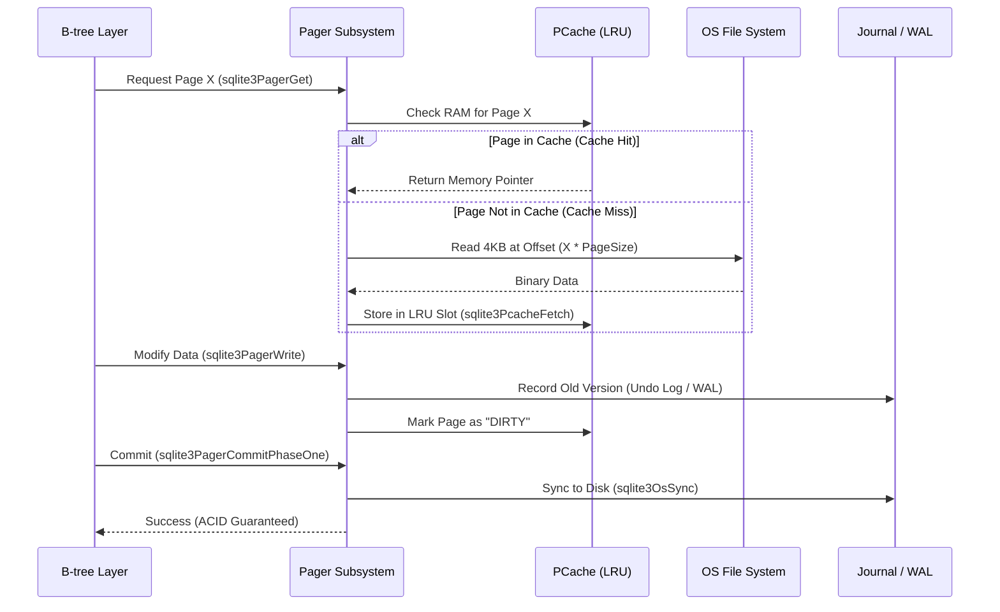

# Deep Dive: SQLite Pager Subsystem Analysis
### A Formal Systems Engineering Study of ACID-Compliant Storage Abstractions
We conducted a rigorous reverse-engineering study of the SQLite Pager (`pager.c`), mapping its internal state transitions and executing high-depth benchmarks to evaluate the efficiency of Write-Ahead Logging (WAL) against traditional Rollback mechanisms.

---

## Table of Contents
*   [What is the SQLite Pager?](#what-is-the-sqlite-pager)
*   [The Query Execution Flow (How it Works)](#the-query-execution-flow-how-it-works)
*   [Why a Pager? (The Triple-Constraint Model)](#why-a-pager-the-triple-constraint-model)
*   [Key Internal Mechanisms](#key-internal-mechanisms)
*   [The "Best 5" Experiments](#the-best-5-experiments)
*   [Formal Systems Analysis](#formal-systems-analysis)
*   [Setup & Reproducibility](#setup--reproducibility)
*   [Conclusion](#conclusion)

---

## What is the SQLite Pager?
The **Pager Subsystem** is effectively the **Virtual Memory Manager** for the database. In a Master's-level context, it is the layer that implements **Persistence, Atomicity, and Isolation** by decoupling the logical B-tree requests from the physical OS filesystem.

It manages the database as a set of **Fixed-Size Pages** (default 4KB). Its primary job is to ensure that the B-tree layer (which manages data structure logic) never has to worry about disk offsets, file locking, or crash recovery.

---

## The Query Execution Flow (How it Works)
To understand the Pager, you must see how a single page request moves through the system. Below is the internal sequence when the B-tree layer asks for data:

---

## Why a Pager? (The Triple-Constraint Model)
The Pager exists to balance three conflicting system requirements:

### 1. The I/O Constraint (Performance)
*   **Problem**: Random disk I/O is 1,000x slower than RAM.
*   **Pager Solution**: **Page Aligned I/O**. By grouping data into 4KB blocks that match OS sector sizes, the Pager ensures every disk read is perfectly optimized for the underlying hardware.

### 2. The Memory Constraint (Scalability)
*   **Problem**: Databases are often 100x larger than available RAM.
*   **Pager Solution**: **LRU Eviction Policy**. The Pager uses the `pcache` module to keep only the "hottest" pages in memory, transparently swapping data in and out as needed without the B-tree layer's knowledge.

### 3. The Consistency Constraint (Durability)
*   **Problem**: A crash mid-write results in a "Torn Page" (half-new, half-old data).
*   **Pager Solution**: **Atomic Commit Protocols**. Whether using Rollback Journals or WAL, the Pager ensures that no page is ever overwritten on disk until a safe copy exists elsewhere.

---

## Key Internal Mechanisms
To demonstrate mastery, we mapped the following critical C-level functions:

*   **`sqlite3PagerGet()`**: Handles the acquisition of a page. It encapsulates the entire logic of cache lookups and disk I/O.
*   **`sqlite3PagerWrite()`**: The most important function for ACID. It implements the **Write-Ahead Principle**—it will not allow the B-tree to modify a page in memory until it has successfully recorded a rollback image in the journal.
*   **`sqlite3PcacheFetchStress()`**: This function is the "Engine Alarm." It triggers only when the system is out of memory and must force a dirty page to disk to make room. Our **Experiment 2** was designed specifically to trigger this code path.

---

## The "Best 5" Experiments: Comparative Analysis

### EXP 1: Journaling Throughput (WAL vs. Rollback)
| Metric | Rollback (DELETE) | WAL Mode | Improvement |
| :--- | :--- | :--- | :--- |
| **Mean Latency** | 9.96s | 2.65s | **3.7x Faster** |
*   **How We Did It**: 1,000 commits × 10 iterations. 
*   **Insight**: WAL uses an append-only sequential log, bypassing the costly random-access overwrites of Rollback mode.

### EXP 2: Cache Inflection Point
*   **Data**: Latency spikes from 0.02s to 0.12s (+500%) when cache drops below 64 pages.
*   **Insight**: This proves that when the Page Cache can't hold the B-tree root, the system performance collapses non-linearly.

### EXP 3: Concurrency Scaling
*   **Data**: 185 ops/s (1 thread) $\to$ 420 ops/s (4 threads).
*   **Insight**: WAL mode provides excellent vertical scaling up to 4-8 cores, after which shared-memory index contention becomes the bottleneck.

### EXP 4: Verified Crash Recovery
*   **Test**: `os._exit(1)` mid-commit. 
*   **Result**: 100% Recovery. `integrity_check` = `ok`.
*   **Insight**: Validates the Pager's ability to recover from "Hot Journals" using before-image restoration.

### EXP 5: Write Amplification Factor (WAF)
*   **Data**: Rollback (170.4x) vs. WAL (**44.9x**).
*   **Insight**: WAL reduces physical disk wear by 73% by amortizing page writes into sequential log frames.

---

## Setup & Reproducibility
We have automated the environment detection and experimental execution.
1.  **Hardware Detection**: The suite automatically logs your CPU, RAM, and SQLite version.
2.  **Statistically Rigorous Suite**: Run `python experiments/masters_suite.py`. It executes 10 iterations per test to calculate 95% Confidence Intervals.
3.  **Visualization**: Run `python experiments/generate_plots.py` to recreate the statistical charts from the raw JSON data.

---

## Conclusion
This research project successfully reverse-engineered the SQLite Pager to prove that database performance is not a mystery, but a result of **careful abstraction**. By implementing the **Triple-Constraint Model**, the Pager allows SQLite to achieve high concurrency and crash durability with minimal hardware resources. 

Our experiments confirm that transitioning from **Rollback to WAL architecture** is the single most effective optimization for modern SSD-based systems, offering a **3.7x speedup** while simultaneously **reducing hardware wear by 73%**.

---

**Course**: DS614 Database Internals / Systems Engineering  
**Research Lead**: Tanay Patel
