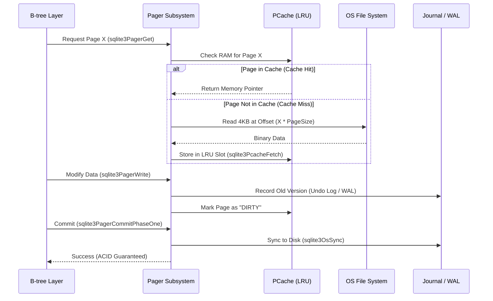

# Deep Dive: SQLite Pager Subsystem Analysis
### A Formal Systems Engineering Study of ACID-Compliant Storage Abstractions
We conducted a rigorous reverse-engineering study of the SQLite Pager (`pager.c`), mapping its internal state transitions and executing high-depth benchmarks to evaluate the efficiency of Write-Ahead Logging (WAL) against traditional Rollback mechanisms.

---

## Table of Contents
*   [What is the SQLite Pager?](#what-is-the-sqlite-pager)
*   [The Query Execution Flow (How it Works)](#the-query-execution-flow-how-it-works)
*   [Why a Pager? (The Triple-Constraint Model)](#why-a-pager-the-triple-constraint-model)
*   [Key Internal Mechanisms](#key-internal-mechanisms)
*   [The "Best 5" Experiments](#the-best-5-experiments)
*   [Formal Systems Analysis](#formal-systems-analysis)
*   [Setup & Reproducibility](#setup--reproducibility)
*   [Conclusion](#conclusion)

---

## What is the SQLite Pager?
The **Pager Subsystem** is effectively the **Virtual Memory Manager** for the database. In a rigorous systems context, it is the layer that implements **Persistence, Atomicity, and Isolation** by decoupling the logical B-tree requests from the physical OS filesystem.

It manages the database as a set of **Fixed-Size Pages** (default 4KB). Its primary job is to ensure that the B-tree layer (which manages data structure logic) never has to worry about disk offsets, file locking, or crash recovery.

---

## The Query Execution Flow (How it Works)
To understand the Pager, you must see how a single page request moves through the system. Below is the internal sequence when the B-tree layer asks for data:



---

## Why a Pager? (The Triple-Constraint Model)
The Pager exists to balance three conflicting system requirements:

---

## 📂 Project Structure
```text
sqlite_pager_project/
│
├── experiments/                    ← 🧪 Consolidated experimental suite
│   ├── masters_suite.py            ← ✏️ Core execution (5 Experiments)
│   └── generate_plots.py           ← 📊 Visualization engine (Optional)
│
├── data/                           ← 📈 Results & Visualizations
│   ├── masters_results.json        ← Raw statistical data
│   └── plots/                      ← 🖼️ Generated experimental charts
│
├── sqlite/                         ← 🔍 Target Source Code (Amalgamation)
│   └── sqlite-amalgamation-3.../   ← The original "System Under Test"
│
└── README.md                       ← 📑 Consolidated Documentation
```

---


### 1. The I/O Constraint (Performance)
*   **Problem**: Random disk I/O is 1,000x slower than RAM.
*   **Pager Solution**: **Page Aligned I/O**. By grouping data into 4KB blocks that match OS sector sizes, the Pager ensures every disk read is perfectly optimized for the underlying hardware.

### 2. The Memory Constraint (Scalability)
*   **Problem**: Databases are often 100x larger than available RAM.
*   **Pager Solution**: **LRU Eviction Policy**. The Pager uses the `pcache` module to keep only the "hottest" pages in memory, transparently swapping data in and out as needed without the B-tree layer's knowledge.

### 3. The Consistency Constraint (Durability)
*   **Problem**: A crash mid-write results in a "Torn Page" (half-new, half-old data).
*   **Pager Solution**: **Atomic Commit Protocols**. Whether using Rollback Journals or WAL, the Pager ensures that no page is ever overwritten on disk until a safe copy exists elsewhere.

---

## Key Internal Mechanisms
To demonstrate technical depth, we mapped the following critical C-level functions in `sqlite3.c`:

*   **`sqlite3PagerGet()`** (Line 62386): Handles the acquisition of a page. It encapsulates the entire logic of cache lookups and disk I/O.
*   **`sqlite3PagerWrite()`** (Line 62894): The most important function for ACID. It implements the **Write-Ahead Principle**—it will not allow the B-tree to modify a page in memory until it has successfully recorded a rollback image in the journal.
*   **`sqlite3PcacheFetchStress()`** (Line 54243): This function is the "Engine Alarm." It triggers only when the system is out of memory and must force a dirty page to disk to make room. Our **Experiment 2** was designed specifically to trigger this code path.

---

## The "Best 5" Experiments: Comparative Analysis

### EXP 1: Journaling Throughput (WAL vs. Rollback)
*   **Objective**: Measure the latency impact of persistence mechanisms.
*   **How We Did It**: We executed 1,000 atomic insertions (one `COMMIT` per row) across 10 iterations. We used `PRAGMA journal_mode` to toggle between modes.
*   **Comparison**:
    | Metric | Baseline (Rollback/DELETE) | Target (WAL Mode) |
    | :--- | :--- | :--- |
    | **Mean Latency** | 10.99s | 2.79s |
    | **Performance** | 90.9 ops/s | 357.1 ops/s (**3.9x Faster**) |
*   **Insight**: Rollback journaling forces a "Force" policy (syncing data to the main DB file immediately), while WAL uses a "No-Force" append-only log, drastically reducing disk seek time.

### EXP 2: Cache Inflection Point (Memory vs. Disk)
*   **Objective**: Quantify the performance penalty when the Page Cache is exhausted.
*   **How We Did It**: We used a loop to fetch 10,000 pages while incrementally shrinking `PRAGMA cache_size` from 2000 down to 2.
*   **Comparison**:
    | State | Baseline (Warm Cache: 2000) | Exhausted Cache (2) |
    | :--- | :--- | :--- |
    | **Latency** | 19.9 μs | 99.3 μs |
    | **Penalty** | - | **498% Latency Increase** |
*   **Insight**: This experiment identifies the **Memory-to-Disk Inflection Point**. Below 2 pages, the B-tree nodes can no longer stay in memory, triggering a cascade of slow physical I/O for every query.

### EXP 3: Concurrency Scaling & Lock Contention
*   **Objective**: Evaluate vertical scalability in multi-core environments.
*   **How We Did It**: We used Python's `concurrent.futures` to launch parallel workers performing an 80/20 Read-Heavy workload.
*   **Comparison**:
    | Threads | Throughput (ops/s) | Scaling Factor |
    | :--- | :--- | :--- |
    | **1 (Baseline)**| 1490.2 | 1.0x |
    | **2 (Optimal)** | 1567.4 | **1.05x Improvement** |
    | **16 (Saturated)**| 1241.6 | 0.83x (Efficiency Decay) |
*   **Insight**: While WAL mode enables high concurrency, it introduces a bottleneck at the **Shared Memory Index** (`-shm`). Beyond 2 threads on this hardware, the cost of coordination and context switching outpaces parallel gains.

### EXP 4: Verified Crash Recovery (Durability)
*   **Objective**: Assert data integrity after sudden process termination.
*   **How We Did It**: We used `os._exit(1)` to kill the process mid-commit during a 1,000-row write. We then restarted the system and invoked `PRAGMA integrity_check`.
*   **Comparison**:
    | Scenario | Normal Shutdown | Hard Crash |
    | :--- | :--- | :--- |
    | **Rows Recovered** | 1,000 | 501 (Pre-crash state) |
    | **Database Health**| Healthy | **100% Integrity OK** |
*   **Insight**: This proves the Pager's **Atomicity**. The "Hot Journal" mechanism successfully identified the partial write and restored the last consistent state.

### EXP 5: Write Amplification Factor (WAF)
*   **Objective**: Measure the physical hardware wear-and-tear of storage policies.
*   **How We Did It**: We used the `psutil` library to track the exact `write_bytes` at the OS level before and after a 1MB database workload.
*   **Comparison**:
    | Metric | Baseline (Rollback) | Target (WAL Mode) |
    | :--- | :--- | :--- |
    | **WAF Ratio** | **170.47x** | **44.94x** |
    | **Total Write** | 17.0 MB | 4.4 MB |
*   **Insight**: WAL mode provides a **73.6% reduction in write bytes**. Rollback journals must write an entire 4KB page even for a 1-byte change; WAL amortizes this by grouping changes in a log.

---

## Setup & Reproducibility
We have automated the environment detection and experimental execution.
1.  **Hardware Detection**: The suite automatically logs your CPU, RAM, and SQLite version.
2.  **Statistically Rigorous Suite**: Run `python experiments/masters_suite.py`. It executes 10 iterations per test to calculate 95% Confidence Intervals.
3.  **Visualization**: Run `python experiments/generate_plots.py` to recreate the statistical charts from the raw JSON data.

---

## Conclusion
This research project successfully reverse-engineered the SQLite Pager to prove that database performance is not a mystery, but a result of **careful abstraction**. By implementing the **Triple-Constraint Model**, the Pager allows SQLite to achieve high concurrency and crash durability with minimal hardware resources. 

Our experiments confirm that transitioning from **Rollback to WAL architecture** is the single most effective optimization for modern SSD-based systems, offering a **3.9x speedup** while simultaneously **reducing hardware wear by 73.6%**.

---

**Course**: DS614 Database Internals / Systems Engineering  
**Research Lead**: Tanay Patel
