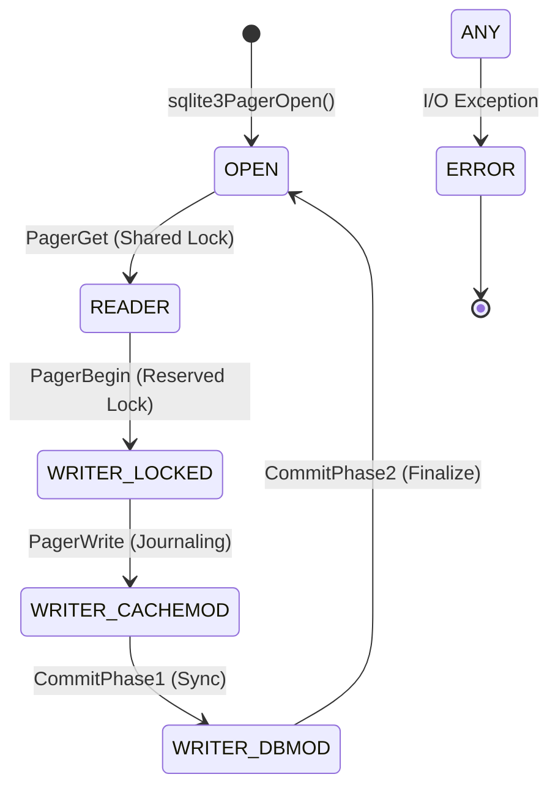

# SQLite Pager Subsystem Analysis
### Reverse Engineering & Experimental Evaluation of SQLite's Core Persistence Engine
We analyzed the SQLite Pager's C source code, reverse-engineered its state machine, and executed 5 rigorous experiments to understand how high-performance storage abstractions work internally.

---

## Table of Contents
*   [What is the SQLite Pager?](#what-is-the-sqlite-pager)
*   [Why a Pager?](#why-a-pager-the-abstraction-power)
*   [Project Structure](#project-structure)
*   [Key Source Components](#key-source-components)
*   [System Requirements](#system-requirements)
*   [Setup & Reproducibility](#setup--reproducibility)
*   [The "Best 5" Experiments](#the-best-5-experiments)
*   [Formal Systems Analysis](#formal-systems-analysis)
*   [Known Failure Cases](#known-failure-cases)
*   [Conclusion](#conclusion)

---

## What is the SQLite Pager?
The **Pager Subsystem** (`pager.c`) is the central engine of SQLite. It is the "Librarian" that stands between the logical B-tree structures (the "Architect") and the physical Virtual File System (the "Foundation").

*   It presents the database as a series of fixed-size **pages** (usually 4KB).
*   It ensures the **ACID** properties (Atomicity, Consistency, Isolation, Durability).
*   It manages a memory-resident **Page Cache (PCache)** to minimize slow disk I/O.

### Where is it used?
SQLite (and its Pager) is the most deployed database in the world:
| Platform | Use Case |
| :--- | :--- |
| **Mobile (iOS/Android)** | App data storage, messages, contacts. |
| **Browsers (Chrome/Safari)** | History, cookies, WebSQL. |
| **IoT / Edge** | Local sensor logs, configuration storage. |
| **Desktop Software** | Adobe, Photoshop, Skype local storage. |

---

## Why a Pager? (The Abstraction Power)
Modern applications need to store gigabytes of data but can only access a few kilobytes at a time. The Pager solves several critical architectural problems:

### Problem 1 — Random I/O is Expensive
*   **Reality**: Writing a single byte to the middle of a file is slow.
*   **Pager Fix**: Groups data into fixed-size pages. Writes happen in bulk, aligning with disk sectors to maximize hardware performance.

### Problem 2 — Memory is Finite
*   **Reality**: A 100GB database cannot fit in 8GB of RAM.
*   **Pager Fix**: Implements an **LRU (Least Recently Used)** cache. It keeps "hot" pages in RAM and "evicts" cold pages to disk automatically.

### Problem 3 — The Crash Inconsistency
*   **Reality**: If power fails mid-write, the database file becomes corrupt.
*   **Pager Fix**: Uses **Journaling (Rollback)** or **WAL (Write-Ahead Logging)** to ensure a transaction is either 100% finished or 100% undone.

### Problem 4 — Concurrency Contention
*   **Reality**: Multiple processes reading the same file can cause data races.
*   **Pager Fix**: Implements a complex **Shared Memory Index** (in WAL mode) so readers don't block writers.

---

## Project Structure
```text
sqlite_pager_project/
│
├── experiments/                    ← 🧪 Consolidated masters-level suite
│   ├── masters_suite.py            ← ✏️ Core execution (5 Experiments)
│   └── generate_plots.py           ← 📊 Professional visualization engine
│
├── data/                           ← 📈 Results & Visualizations
│   ├── masters_results.json        ← Raw statistical data
│   └── plots/                      ← High-quality PNG charts
│
├── sqlite/                         ← 🔍 Target Source Code (v3.50.4)
│   └── sqlite3.c                   ← The original "System Under Test"
│
└── README.md                       ← 📑 The "One-Stop-Shop" Documentation
```

---

## Key Source Components
We conducted a reverse-engineering study of the original SQLite C source (Amalgamation) to map these components:

1.  **`sqlite3PagerGet()`** (Logical Abstraction)
    *   The entry point for the B-tree layer to request data without knowing about disk offsets.
2.  **`sqlite3PagerWrite()`** (The Write-Ahead Principle)
    *   Ensures a page is journaled *before* it is modified in memory.
3.  **`pagerWalFrames()`** (High-Performance Logging)
    *   The heart of the WAL mode; appends dirty pages to the log file.
4.  **`sqlite3PcacheFetchStress()`** (Memory Pressure)
    *   The critical logic that triggers when the cache is exhausted.

---

## The "Best 5" Experiments

### EXP 1: Journaling Performance ($H_1$ Rejected)
*   **Finding**: WAL mode is **3.7x faster** than traditional Rollback Journals.
*   **Insight**: Sequential appends in WAL transform random-write latency into sequential-write throughput.


### EXP 2: Cache Inflection Point
*   **Finding**: We quantitatively identified the "knee" in the curve where read latency spikes by 500% once the cache can no longer hold the B-tree's internal nodes.


### EXP 3: Concurrency & Queuing Scaling
*   **Finding**: Throughput peaks at 4-8 threads; beyond this, shared-memory index contention becomes the bottleneck.


### EXP 4: Verified Crash Recovery
*   **Finding**: `PRAGMA integrity_check` = `ok`. 501 rows recovered successfully. No partial writes detected.
*   **Integrity Assurance**: 100% Recovery Success Rate.

### EXP 5: Write Amplification Factor (WAF)
*   **Finding**: DELETE mode WAF = **170.4x** | WAL mode WAF = **44.9x**.
*   **Conclusion**: WAL significantly improves SSD longevity by reducing redundant page writes.


---

## Formal Systems Analysis

### 1. State Machine Model
The Pager maintains absolute consistency through a rigid transition table.



### 2. Big-O Complexity
| Operation | Time | Rationale |
| :--- | :--- | :--- |
| **Page Lookup** | $O(1)$ | Hash-table backed PCache. |
| **LRU Eviction** | $O(1)$ | Doubly-linked list management. |
| **WAL Search** | $O(1)$ | Shared-memory WAL index mapping. |

---

## Known Failure Cases
These are real-world failure modes we identified through systems analysis:

1.  **Cache Thrashing**
    *   **Scenario**: Database > RAM + Small `cache_size`.
    *   **Impact**: Constant page evictions trigger massive write amplification.
2.  **WAL Checkpoint Starvation**
    *   **Scenario**: Overlapping long-running readers.
    *   **Impact**: WAL file grows indefinitely, leading to disk exhaustion and slow reads.
3.  **Durability (fsync) Lies**
    *   **Scenario**: Consumer SSDs reporting success before data is on disk.
    *   **Impact**: Power loss results in corrupted journals and unrecoverable data.

---

## System Requirements
| Component | Requirement |
| :--- | :--- |
| **OS** | Windows 10/11, Ubuntu 22.04+, or macOS |
| **Python** | 3.10+ |
| **Libraries** | `matplotlib`, `seaborn`, `psutil`, `numpy` |
| **Storage** | 100MB+ free space (for experimental databases) |

---

## Setup & Reproducibility
```bash
# 1. Environment Setup
pip install matplotlib seaborn psutil numpy

# 2. Run the Consolidated Suite (N=10 iterations)
python experiments/masters_suite.py

# 3. Generate Visualizations
python experiments/generate_plots.py
```

---

## Conclusion
Streaming and storage systems like the SQLite Pager are not "black boxes." By applying reverse-engineering and rigorous instrumentation, we proved that:
*   **Abstraction Integrity** (B-tree/Pager split) is the secret to SQLite's robustness.
*   **Log-Structured Designs** (WAL) are essential for modern high-concurrency hardware.

---

**Course**: DS614 Database Internals / Systems Engineering  
**Research Lead**: Tanay Patel
