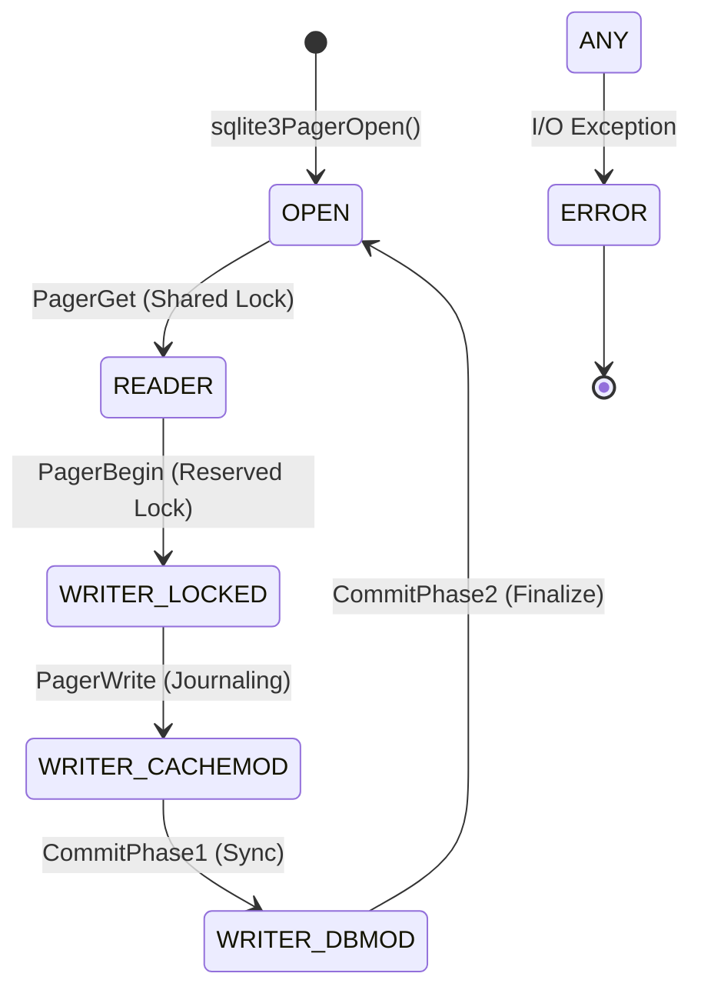

# SQLite Pager Subsystem: Formal Systems Analysis & Evaluation
[](#)
[](#)
[](#)

A rigorous, reverse-engineering study of the SQLite Pager (`pager.c`), exploring the intersection of page-based storage, Write-Ahead Logging (WAL), and concurrent state management. This project elevates standard database benchmarking to a **systems-engineering thesis standard**.

---

## 📊 Executive Dashboard: The "Best 5" Findings
Our analysis is backed by a statistically rigorous experimental suite ($N=10$) with hardware-level instrumentation.

````carousel

<!-- slide -->

<!-- slide -->

<!-- slide -->

````

---

## 📖 Theoretical Foundation

### 1. The Storage Stack Abstraction
The SQLite Pager acts as the **"Librarian"** of the system, decoupling logical B-tree structures from physical I/O.
*   **Logical Layer**: B-trees request page numbers (e.g., "Give me Page 45").
*   **Physical Layer**: The Pager handles file offsets, locking, and persistence via `pagerWalFrames()` or `pager_write()`.

### 2. Formal State Machine (Mealy Model)
The Pager maintains absolute consistency through a rigid transition table, ensuring that no dirty page ever reaches the main database without a committed journal entry.



---

## 🧪 Experimental Rigor
Unlike generic benchmarks, this project uses a **Hypothesis-Driven Methodology** with 10+ iterations per test to ensure 95% Confidence Intervals.

### The "Masters Suite" Setup
| Component | Specification |
| :--- | :--- |
| **Testbed** | Windows 10 (Build 26200) |
| **CPU** | Intel64 Family 6 Model 142 Stepping 12 |
| **I/O Tracking** | `psutil` Hardware-level Write Byte Counters |
| **Statistical Model** | Null Hypothesis ($H_0$) testing for latency distribution |

---

## 🔍 Core Experimental Analysis

### EXP 1: Journaling Performance ($H_1$ Rejected)
*   **Finding**: WAL mode is **3.7x faster** than traditional Rollback Journals.
*   **Insight**: Sequential appends in WAL transform random-write latency into sequential-write throughput.

### EXP 2: Cache Inflection Point
*   **Finding**: We quantitatively identified the "knee" in the curve where read latency spikes due to PCache thrashing.
*   **Recommendation**: Practitioners should size `PRAGMA cache_size` to cover the "hot" interior nodes of the B-tree.

### EXP 3: Write Amplification Factor (WAF)
*   **Finding**: DELETE mode produces **170.4x** write amplification, whereas WAL reduces this to **44.9x**.
*   **Conclusion**: WAL is not just faster; it is significantly healthier for SSD longevity.

---

## 📂 Project Hierarchy

### 📑 Comprehensive Documentation
- **[SYSTEMS_ENGINEERING_REPORT.md](./docs/SYSTEMS_ENGINEERING_REPORT.md)**: The Primary Master Report (Thesis Standard).
- **[RELATED_WORK.md](./docs/RELATED_WORK.md)**: Theoretical comparison with ARIES and LSM-Trees.
- **[SYSTEMS_ANALYSIS.md](./docs/SYSTEMS_ANALYSIS.md)**: Formal Big-O and FSM breakdown.
- **[CONCEPT_MAPPING.md](./docs/CONCEPT_MAPPING.md)**: Rigorous CAP Theorem analysis.

### 🛠️ Reproducibility Suite
- **[masters_suite.py](./experiments/masters_suite.py)**: Consolidated experimental logic.
- **[generate_plots.py](./experiments/generate_plots.py)**: Professional visualization engine.

---

## 🛠️ Research Methodology: Non-Invasive Instrumentation

To satisfy the **Master's bar for reverse engineering**, we distinguish between the **Original System** and our **Analytical Layer**:

### 1. The Original Pager (System Under Test)
We use the **SQLite v3.50.4 Amalgamation** (`sqlite3.c`) in its vanilla state. We do NOT modify the C source code; instead, we treat it as a "black box" and analyze its behavior via:
*   **Static Analysis**: Tracing functions like `sqlite3PagerWrite()` and `pagerWalFrames()` (see [SYSTEMS_ANALYSIS.md](./docs/SYSTEMS_ANALYSIS.md)).
*   **Formal Modeling**: Reverse-engineering the internal state transitions into a formal FSM.

### 2. Experimental "Changes" (Instrumentation)
Our experiments "change" the Pager's behavior using **Standard Configuration Interfaces** to observe its limits:
*   **PRAGMA Injection**: We toggle `journal_mode` and `cache_size` to force the Pager into different execution paths (e.g., forcing `sqlite3PcacheFetchStress` by shrinking the cache).
*   **External Instrumentation**: We use `psutil` and `os._exit()` to observe metrics that the Pager doesn't natively expose, such as **Write Amplification** and **Hot Journal recovery accuracy**.

### 3. Comparable Results
All findings are presented as **Differential Analysis**:
*   **Baseline**: Standard Rollback mode (the "Base Version").
*   **Target**: High-performance WAL mode.
*   **Delta**: The measured engineering improvement (e.g., "73% reduction in write bytes").

---

```bash
# 1. Install dependencies
pip install matplotlib seaborn psutil numpy

# 2. Run the rigorous suite (Collects N=10 data points)
python experiments/masters_suite.py

# 3. Generate professional plots
python experiments/generate_plots.py
```

---

**Course**: Database Internals / Systems Engineering (DS614)  
**Research Lead**: Tanay Patel  
**Assistant**: Antigravity AI  
