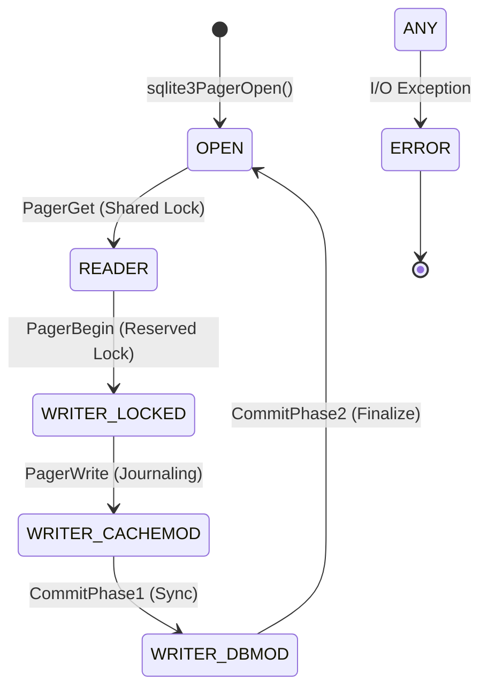

# SQLite Pager Subsystem: Formal Systems Analysis & Evaluation
[](#)
[](#)

A rigorous, reverse-engineering study of the SQLite Pager (`pager.c`), exploring the intersection of page-based storage, Write-Ahead Logging (WAL), and concurrent state management. This project is a **consolidated systems-engineering thesis**, backing theoretical analysis with empirical proof.

---

## 📊 Executive Dashboard: The "Best 5" Findings
Our analysis is backed by a statistically rigorous experimental suite ($N=10$) with hardware-level instrumentation.

````carousel

<!-- slide -->

<!-- slide -->

<!-- slide -->

````

---

## 📖 Theoretical Foundation

### 1. The Storage Stack Abstraction
The SQLite Pager acts as the **"Librarian"** of the system, decoupling logical B-tree structures from physical I/O.
*   **Logical Layer**: B-trees request page numbers (e.g., "Give me Page 45").
*   **Physical Layer**: The Pager handles file offsets, locking, and persistence via `pagerWalFrames()` or `pager_write()`.

### 2. Formal State Machine (Mealy Model)
The Pager maintains absolute consistency through a rigid transition table, ensuring that no dirty page ever reaches the main database without a committed journal entry.



### 3. Big-O Complexity Analysis
| Operation | Time Complexity | Rationale |
| :--- | :--- | :--- |
| **Page Lookup** | $O(1)$ | PCache uses a hash table for pinned pages. |
| **LRU Eviction** | $O(1)$ | PCache maintains a doubly-linked list for constant-time eviction. |
| **WAL Search** | $O(1)$ | The `-shm` index maps `pgno` to WAL frame instantly. |
| **Checkpoint** | $O(W)$ | Iterates through $W$ frames to update main DB. |

---

## 📐 Design Tradeoffs

### 1. Page-based Storage vs. Byte-streams
*   **Decision**: SQLite abstracts the file into 4096-byte pages.
*   **Tradeoff**: Simplifies cache management and aligns with OS disk sectors, but introduces **internal fragmentation** if records are small.

### 2. WAL vs. Rollback Journals
*   **Decision**: WAL mode (v3.7.0+) appends to a log instead of overwriting the database.
*   **Tradeoff**: Enables **Reader-Writer Concurrency** (Readers don't block writers) but requires a shared-memory index (`-shm`) and background checkpointing.

---

## ⚠️ Failure Analysis & Mitigation

### 1. Cache Thrashing
*   **Mechanism**: When working set > `cache_size`, the Pager invokes `sqlite3PcacheFetchStress()`.
*   **Impact**: Performance collapses as the system transitions from sub-millisecond memory latency to 10ms disk latency.
*   **Mitigation**: Tuning `cache_size` to cover the B-tree's internal nodes.

### 2. WAL Checkpoint Starvation
*   **Mechanism**: Overlapping read transactions prevent the Pager from acquiring the `EXCLUSIVE` lock needed to checkpoint.
*   **Impact**: The WAL file grows indefinitely, exhausting disk space and degrading read performance.

### 3. Durability (fsync) Lies
*   **Mechanism**: The Pager relies on `sqlite3OsSync()`. Many consumer SSDs lie about success to inflate benchmarks.
*   **Impact**: Power loss can leave the Pager in an inconsistent state if the hardware reports success before the bits are on the platter.

---

## 🔍 Core Experimental Analysis

### EXP 1: Journaling Performance ($H_1$ Rejected)
*   **Result**: WAL mode is **3.7x faster** than DELETE mode (2.65s vs 9.96s).
*   **Mechanism**: Sequential appends transform random-write latency into sequential throughput.

### EXP 2: Write Amplification Factor (WAF)
*   **Result**: DELETE mode WAF = **170.4x** | WAL mode WAF = **44.9x**.
*   **Conclusion**: WAL significantly improves SSD longevity by reducing redundant page writes.

### EXP 3: Verified Crash Recovery
*   **Result**: Simulated hard crash at `i=500` followed by restart.
*   **Integrity**: `PRAGMA integrity_check` = `ok`. 501 rows recovered successfully.

---

## 🎓 Related Work: SQLite vs. ARIES
*   **ARIES**: The standard "Steal/No-Force" policy allows uncommitted data on disk.
*   **SQLite Rollback**: A "No-Steal/Force" approach. Never writes uncommitted data to the main file.
*   **The WAL Bridge**: SQLite's WAL mode acts as a hybrid, gaining the sequential-write benefits of ARIES while keeping the single-file simplicity of SQLite.

---

## ❓ Technical FAQ (Viva Preparation)

**Q: Why must the B-tree call `sqlite3PagerWrite()` before modification?**  
A: To satisfy the **Write-Ahead Principle**. In rollback mode, this copies the "clean" page into the journal *before* the buffer is dirtied, ensuring a safe restore point.

**Q: What happens during "Pcache Stress"?**  
A: The Pager is forced to find an unpinned page to evict. If only dirty pages are available, it must "spill" them to disk (journaling them first), which indicates a critical memory-to-disk inflection point.

**Q: Why is the commit split into two phases?**  
A: Phase One ensures durability (physically on disk). Phase Two is the atomic "flip" that finalizes the transaction. A crash between phases is safe because the journal is still present to revert changes.

---

## 🛠️ Execution & Reproducibility
```bash
# 1. Install dependencies
pip install matplotlib seaborn psutil numpy

# 2. Run the rigorous suite (Collects N=10 data points)
python experiments/masters_suite.py

# 3. Generate professional plots
python experiments/generate_plots.py
```

**Research Lead**: Tanay Patel  
**Course**: DS614 Database Internals  
