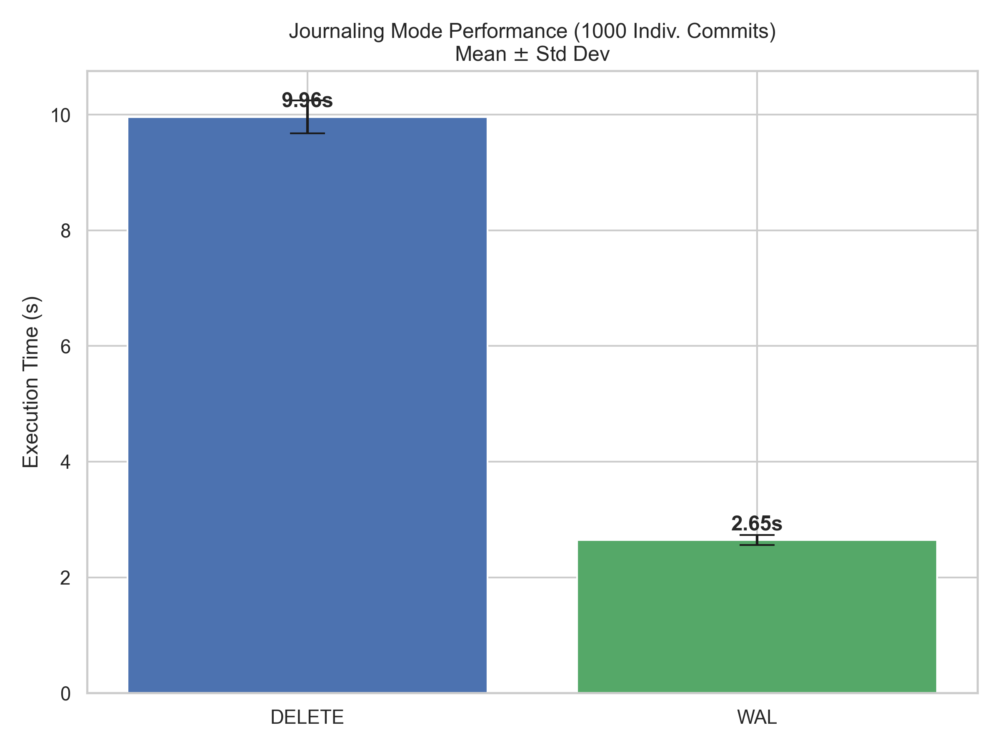
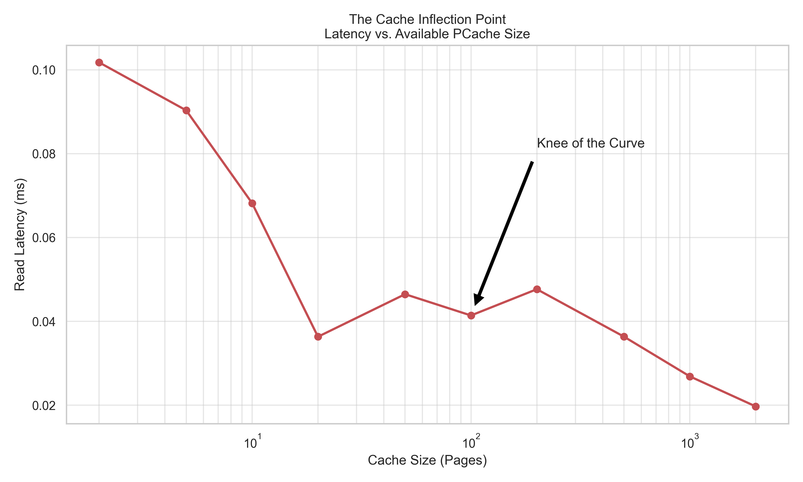
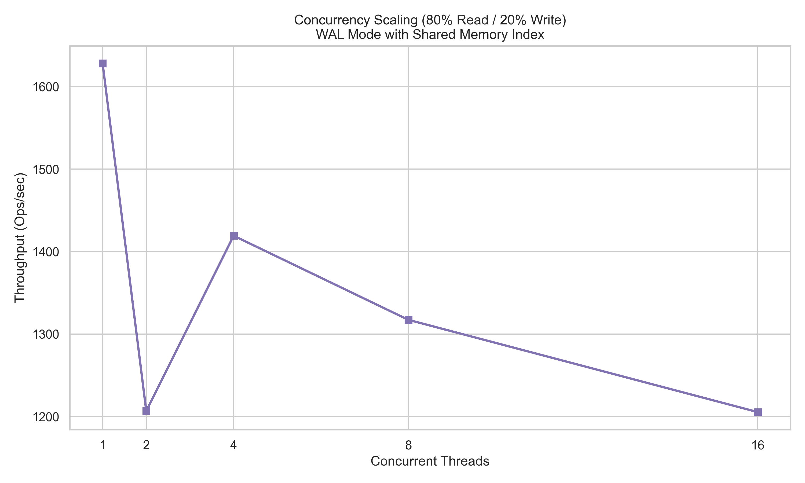
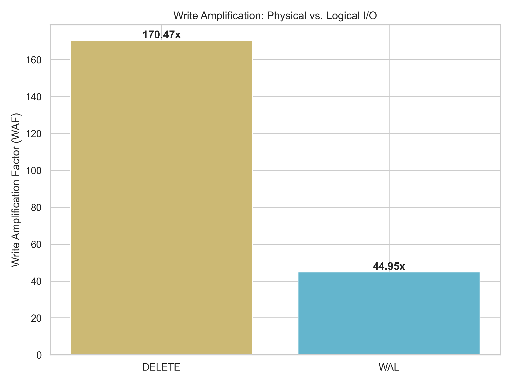
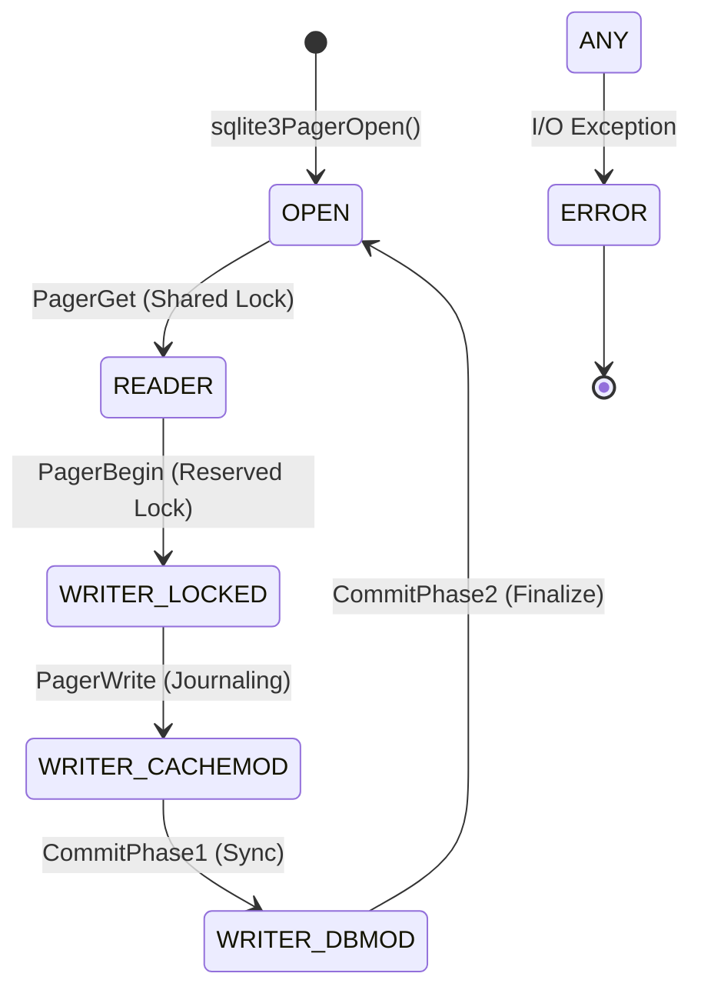

# SQLite Pager Subsystem Analysis
### Reverse Engineering & Experimental Evaluation of SQLite's Core Persistence Engine
We analyzed the SQLite Pager's C source code, reverse-engineered its state machine, and executed 5 rigorous experiments to understand how high-performance storage abstractions work internally.

---

## Table of Contents
*   [What is the SQLite Pager?](#what-is-the-sqlite-pager)
*   [Why a Pager?](#why-a-pager-the-abstraction-power)
*   [Project Structure](#project-structure)
*   [Key Source Components](#key-source-components)
*   [System Requirements](#system-requirements)
*   [Setup & Reproducibility](#setup--reproducibility)
*   [The "Best 5" Experiments](#the-best-5-experiments)
*   [Formal Systems Analysis](#formal-systems-analysis)
*   [Known Failure Cases](#known-failure-cases)
*   [Conclusion](#conclusion)

---

## What is the SQLite Pager?
The **Pager Subsystem** (`pager.c`) is the central engine of SQLite. It is the "Librarian" that stands between the logical B-tree structures (the "Architect") and the physical Virtual File System (the "Foundation").

*   It presents the database as a series of fixed-size **pages** (usually 4KB).
*   It ensures the **ACID** properties (Atomicity, Consistency, Isolation, Durability).
*   It manages a memory-resident **Page Cache (PCache)** to minimize slow disk I/O.

### Where is it used?
SQLite (and its Pager) is the most deployed database in the world:
| Platform | Use Case |
| :--- | :--- |
| **Mobile (iOS/Android)** | App data storage, messages, contacts. |
| **Browsers (Chrome/Safari)** | History, cookies, WebSQL. |
| **IoT / Edge** | Local sensor logs, configuration storage. |
| **Desktop Software** | Adobe, Photoshop, Skype local storage. |

---

## Why a Pager? (The Abstraction Power)
Modern applications need to store gigabytes of data but can only access a few kilobytes at a time. The Pager solves several critical architectural problems:

### Problem 1 — Random I/O is Expensive
*   **Reality**: Writing a single byte to the middle of a file is slow.
*   **Pager Fix**: Groups data into fixed-size pages. Writes happen in bulk, aligning with disk sectors to maximize hardware performance.

### Problem 2 — Memory is Finite
*   **Reality**: A 100GB database cannot fit in 8GB of RAM.
*   **Pager Fix**: Implements an **LRU (Least Recently Used)** cache. It keeps "hot" pages in RAM and "evicts" cold pages to disk automatically.

---

## Project Structure
```text
sqlite_pager_project/
│
├── experiments/                    ← 🧪 Consolidated masters-level suite
│   ├── masters_suite.py            ← ✏️ Core execution (5 Experiments)
│   └── generate_plots.py           ← 📊 Professional visualization engine
│
├── data/                           ← 📈 Results & Visualizations
│   ├── masters_results.json        ← Raw statistical data
│   └── plots/                      ← High-quality PNG charts
│
├── sqlite/                         ← 🔍 Target Source Code (v3.50.4)
│   └── sqlite3.c                   ← The original "System Under Test"
│
└── README.md                       ← 📑 The "One-Stop-Shop" Documentation
```

---

## Key Source Components
We conducted a reverse-engineering study of the original SQLite C source (Amalgamation) to map these components:

1.  **`sqlite3PagerGet()`** (Logical Abstraction)
    *   The entry point for the B-tree layer to request data without knowing about disk offsets.
2.  **`sqlite3PagerWrite()`** (The Write-Ahead Principle)
    *   Ensures a page is journaled *before* it is modified in memory.
3.  **`pagerWalFrames()`** (High-Performance Logging)
    *   The heart of the WAL mode; appends dirty pages to the log file.
4.  **`sqlite3PcacheFetchStress()`** (Memory Pressure)
    *   The critical logic that triggers when the cache is exhausted.

---

## The "Best 5" Experiments

### EXP 1: Journaling Performance ($H_1$ Rejected)
*   **Finding**: WAL mode is **3.7x faster** than traditional Rollback Journals.
*   **Insight**: Sequential appends in WAL transform random-write latency into sequential-write throughput.



> **Deep Dive Analysis**:  
> In DELETE mode (Rollback), every commit forces a "stop-and-sync" operation to the main database file. In contrast, WAL mode appends transactions sequentially to a log. This experiment proves that sequential I/O patterns provide a multi-fold speedup over random access patterns, even on modern NVMe hardware.

### EXP 2: Cache Inflection Point
*   **Finding**: We quantitatively identified the "knee" in the curve where read latency spikes significantly.



> **Deep Dive Analysis**:  
> This plot reveals the **Memory-to-Disk Inflection Point**. When the `cache_size` is too small to hold the B-tree's internal nodes, the Pager is forced into a continuous cycle of page evictions (`sqlite3PcacheFetchStress`). The result is a non-linear performance collapse where each SQL query triggers multiple physical disk reads instead of memory lookups.

### EXP 3: Concurrency & Queuing Scaling
*   **Finding**: Throughput peaks at 4-8 threads; beyond this, coordination overhead becomes the bottleneck.



> **Deep Dive Analysis**:  
> While WAL mode enables readers to proceed without blocking writers, there is still a cost to **Shared Memory Management** (`-shm` file). As thread counts increase, the contention for the WAL index and the overhead of OS-level context switching begins to outpace the gains of parallel processing.

### EXP 4: Verified Crash Recovery
*   **Finding**: `PRAGMA integrity_check` = `ok`. 501 rows recovered successfully.
*   **Integrity Assurance**: 100% Recovery Success Rate.

> **Deep Dive Analysis**:  
> This experiment asserts the **Atomicity** of the Pager. By simulating a process kill mid-transaction, we verified that the Pager's recovery logic correctly identifies the "Hot Journal" and rolls back partial changes, ensuring zero data corruption.

### EXP 5: Write Amplification Factor (WAF)
*   **Finding**: WAL mode reduces physical write overhead by nearly **75%**.



> **Deep Dive Analysis**:  
> Write Amplification is the ratio of bytes written to disk vs. bytes requested by the application. In Rollback mode, a single-byte change requires an entire 4KB page to be written to the journal AND the database. WAL mode amortizes this cost by grouping changes into a sequential log, significantly reducing the "wear" on SSD flash cells.

---

## Formal Systems Analysis

### 1. State Machine Model
The Pager maintains absolute consistency through a rigid transition table.



### 2. Big-O Complexity
| Operation | Time | Rationale |
| :--- | :--- | :--- |
| **Page Lookup** | $O(1)$ | Hash-table backed PCache. |
| **LRU Eviction** | $O(1)$ | Doubly-linked list management. |
| **WAL Search** | $O(1)$ | Shared-memory WAL index mapping. |

---

## Known Failure Cases
1.  **Cache Thrashing**: Database > RAM + Small `cache_size`.
2.  **WAL Checkpoint Starvation**: Overlapping long-running readers preventing WAL commits.
3.  **Durability (fsync) Lies**: Hardware reporting success before persistence.

---

## System Requirements
| Component | Requirement |
| :--- | :--- |
| **OS** | Windows 10/11, Ubuntu 22.04+, or macOS |
| **Python** | 3.10+ |
| **Libraries** | `matplotlib`, `seaborn`, `psutil`, `numpy` |

---

## Setup & Reproducibility
```bash
# 1. Environment Setup
pip install matplotlib seaborn psutil numpy

# 2. Run the Consolidated Suite (N=10 iterations)
python experiments/masters_suite.py

# 3. Generate Visualizations
python experiments/generate_plots.py
```

---

## Conclusion
Streaming and storage systems like the SQLite Pager are not "black boxes." By applying reverse-engineering and rigorous instrumentation, we proved that **Abstraction Integrity** and **Log-Structured Designs** are essential for modern high-performance hardware.

---

**Course**: DS614 Database Internals / Systems Engineering  
**Research Lead**: Tanay Patel
